<h1 align="center">Hi 👋, I'm Mushahid</h1>
<h3 align="center">Full-Stack Developer | DevOps | AI Engineering — I build the app, ship it properly, and I'm not afraid of the AI layer either.</h3>

  

---

### 🧭 About Me

- 🔭 I build full-stack applications end-to-end — from database schema to CI/CD pipeline to cloud deployment
- 🛠️ Comfortable across the stack: React/Next.js frontends, Node.js/Express APIs, and the AWS + Terraform + Docker/Kubernetes infrastructure that runs them
- 💳 I've shipped real payment integrations (Razorpay) with signature-verified webhooks — payment state only ever changes on a server-verified event, never on client trust
- ☁️ I deploy the same app two different ways when it's worth learning both — traditional server *and* serverless — see [`your-drive-storage-app`](https://github.com/mushahid2120/your-drive-storage-app-backend) below
- 🤖 **I build the AI layer myself, not just call an API:** RAG pipelines (Pinecone + LangChain), the Model Context Protocol — both server *and* client side — and agentic tool-calling with memory management
- 📫 Reach me at **md.mushahidansari@gmail.com**

---

### 🛠️ Tech Stack

**Languages**

  
  
  
  
  

**Frontend**

  
  
  
  
  

**Backend**

  
  
  
  
  

**AI / LLM Engineering**

  
  
  
  
  
  

**Databases & Data**

  
  
  
  

**Cloud & DevOps**

  
  
  
  
  
  
  

**Tools & Platforms**

  
  
  
  

---

### 🤖 AI Engineering — built, not just wired up

Before touching a single production repo, I built each of these patterns from the primitives, on both sides where it mattered:

- **RAG pipeline** — PDF → chunked (500 chars / 100 overlap) → Gemini embeddings → **Pinecone** vector search → Groq-grounded generation, with a strict "answer only from context" system prompt
- **MCP — both server and client** — a FastMCP tool server ([`Expense_Tracker_MCP_Server`](https://github.com/mushahid2120/Expense_Tracker_MCP_Server)) *and* a LangChain `MultiServerMCPClient` consumer that discovers, binds, and calls those tools — most people stop at the easier half
- **Agentic tool-calling with bounded memory** — a Groq-powered agent with live web search (Tavily), plus active conversation **summarization** so context stays bounded instead of growing forever
- **Streaming chatbot with persistent memory** — LangGraph `StateGraph` + async SQLite checkpointing, multi-thread conversation history, token-by-token streaming via FastAPI

This work started as self-directed practice and is gradually being promoted into standalone, deployed repos — `Expense_Tracker_MCP_Server` was the first.

---

### 🚀 Featured Projects

<table>
<tr>
<td width="50%" valign="top">

**[📚 BookKart — Full-Stack E-commerce](https://github.com/mushahid2120/BookKart_Ecommerce_FullStack)**

Used-book marketplace with Next.js 16 + TypeScript, Express/MongoDB, JWT access+refresh auth, Razorpay payments, Cloudinary image handling.

`Next.js` `TypeScript` `MongoDB` `Razorpay` · [Live Demo](https://bookkartecommerce.netlify.app)

</td>
<td width="50%" valign="top">

**[☁️ Your Drive — Cloud Storage App](https://github.com/mushahid2120/your-drive-storage-app-backend)**

Google Drive clone: session-based auth (chosen for instant revocation), direct-to-S3 uploads, CloudFront signed downloads, and a Razorpay subscription system where the webhook — not the client — is the only source of truth for activation. Deployed two ways: Netlify+Render **and** S3/CloudFront+Lambda.

`Node.js` `AWS S3/CloudFront/Lambda` `Redis` `Razorpay`

</td>
</tr>
<tr>
<td width="50%" valign="top">

**[🤖 Expense Tracker MCP Server](https://github.com/mushahid2120/Expense_Tracker_MCP_Server)**

An MCP server (FastMCP + SQLAlchemy) that lets AI assistants log and query expenses via natural language. Paired with a self-built MCP *client* that discovers and calls it.

`Python` `FastMCP` `SQLAlchemy` `MCP`

</td>
<td width="50%" valign="top">

**[🏗️ Terraform 3-Tier AWS Infrastructure](https://github.com/mushahid2120/terraform_project_devops)**

Modular Terraform provisioning a full 3-tier architecture — VPC, EC2, RDS, and an ALB + Auto Scaling Group.

`Terraform` `AWS VPC/EC2/RDS/ALB`

</td>
</tr>
<tr>
<td width="50%" valign="top">

**[🐳 3-Tier MERN on Kubernetes](https://github.com/mushahid2120/3-tier-MERN-DevOps)**

MERN stack deployed to Kubernetes with Kustomize, persistent volumes, and a full Jenkins pipeline — app and infra in one repo.

`MERN` `Docker` `Kubernetes` `Jenkins`

</td>
<td width="50%" valign="top">

**[⚙️ Gradle CI/CD Pipeline](https://github.com/mushahid2120/Gradle-project-github-action-DevOps)**

Full DevSecOps pipeline: build → SonarQube → Trivy filesystem scan → Nexus publish → Docker build → Trivy image scan → push. The same pipeline is also implemented with Jenkins + Maven, to prove the pattern isn't tied to one toolchain.

`GitHub Actions` `SonarQube` `Trivy` `Docker`

</td>
</tr>
</table>

---

### 📊 GitHub Stats

<!--
  Self-generated by .github/workflows/update-readme-stats.yml rather than the
  public github-readme-stats.vercel.app / github-readme-streak-stats.herokuapp.com
  endpoints, which are frequently rate-limited or offline.
-->

  
  

  

---

### 🤝 Connect With Me

  
  <!-- Add your LinkedIn/Twitter/portfolio links here, e.g.: -->
  <!--  -->

<i>⭐️ From <a href="https://github.com/mushahid2120">mushahid2120</a> — thanks for stopping by!</i>
